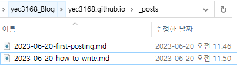

## 파일 이름
`YYYY-MM-DD-TITLE.md` 의 형식으로 파일을 만들어주고 `_post/` 폴더에 넣어준다.


위 사진 처럼 파일을 생성해주면 된다.

## Front Matter
파일을 생성했으면, StackEdit이나 다른 편집기를 통해 파일을 열어 수정하면되는데 파일의 맨 처음은 아래와 같은 양식의 Front Matter을 작성해야한다.
```yaml
---
title: TITLE
date: YYYY-MM-DD HH:MM:SS +/- TTTT
categories: [TOP_CATEGORIE, SUB_CATEGORIE]
tags: [TAG]		# TAG는 반드시 소문자
---
```
> title: 포스팅 제목
> date : 날짜
> Categories : 최대 2개까지 등록 가능
> tags : 0~무한 개 까지 등록

## Table of Contents
**TOC**는 포스트 오른쪽 패널에 위치 하여 이기능을 끄고 싶다면 `config.yml`파일로가서 `toc`값을 `false`로 바꾸어주면된다. 하나의 Posting만 바꾸고 싶다면 아래 내용을 **Front Matter**에 추가하면된다. 
```yaml
---
toc: false
---
```


## Comments
TOC와 마찬가지로 기능을 끄고 싶다면 `config.yml`파일로가서 `comments`값을 `false`로 바꾸어주면된다. 하나의 Posting만 바꾸고 싶다면 아래 내용을 **Front Matter**에 추가하면된다. 

```yaml
---
comments: false
---
```


## Mathematics
Mathematics 기능은 기본적으로 꺼져 있으나 아래 코드를 추가하여 킬 수 있다.
```yaml
---
math: true
---
```


## Mermaid
`Mermaid`는 표 생성 도구이다.
```yaml
---
math: true
---
```

## Images
포스트 최상단에 이미지를 넣고 싶으면 아래와 같이 url를 추가하여 이미지를 넣을 수 있다.
 ```yaml
---
image: /path/to/image-file
---
```

### makedown을 통해 이미지를 넣는 방법
```markdown

_Image Caption_
```
이미지 캡션은 이미지 하단에 달리게 됨.


## Pin
자신의 홈페이지 Home에 특정 게시물을 고정시킬수 있게 해주는 것.

날짜가 최근일수록 위로 올라오게 된다.
```yaml
---
pin: true
---
```

## Code Block

 <code class="highlighter-rouge">```</code>를 통해 코드블럭을 생성가능하다.

## Information
위 글은 [J1mmyson](https://j1mmyson.github.io/posts/postingGuide/#front-matter) 의 블로그를 참고하여 만들어졌다.