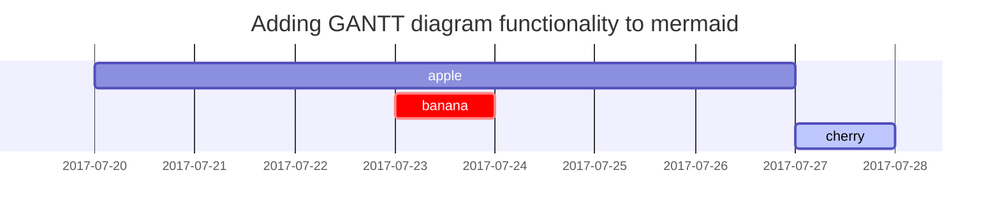

# Information
이 게시물은 [Chirpy](https://chirpy.cotes.page/posts/text-and-typography/)내용을 적은것이다.


## 제목 heading
```html
<h1 >H1 - heading</h1>

<h2 >H2 - heading</h2>

<h3>H3 - heading</h3>

<h4>H4 - heading</h4>
```
<h1>H1 - heading</h1>

<h2>H2 - heading</h2>

<h3>H3 - heading</h3>

<h4>H4 - heading</h4>

## List
### Ordered list
```yaml 
1. Firstly
2. Secondly
3. Thirdly
```
1. Firstly
2. Secondly
3. Thirdly
### Unordered list
```yaml
- Chapter
  + Section
    * Paragraph
```
- Chapter
  + Section
    * Paragraph

### 목록
```yaml
- [ ] Job
  + [x] Step 1
  + [x] Step 2
  + [ ] Step 3
```
- [ ] Job
  + [x] Step 1
  + [x] Step 2
  + [ ] Step 3

### 설명 목록
```yaml
태양
: 지구가 공전하는 별

달
: 지구의 자연위성
```
태양
: 지구가 공전하는 별

달
: 지구의 자연위성


## Block Quote
```
> block quote 사용예시
> > 두개도 가능
```
> block quote 사용예시
> > 두개도 가능

##  Prompts

```yaml
> An example showing the `tip` type prompt.
{: .prompt-tip }

> An example showing the `info` type prompt.
{: .prompt-info }

> An example showing the `warning` type prompt.
{: .prompt-warning }

> An example showing the `danger` type prompt.
{: .prompt-danger }

```

>  `tip` type prompt.
{: .prompt-tip }

>  `info` type prompt.
{: .prompt-info }

> `warning` type prompt.
{: .prompt-warning }

> `danger` type prompt.
{: .prompt-danger }


## Table
```yaml
|회사|나라|
|--|--|
| 삼성 | 한국 |

```
|회사|나라|
|--|--|
| 삼성 | 한국 |

## Link 
```yaml
<http://127.0.0.1:4000>
```
<http://127.0.0.1:4000>

## Footnote
덧붙이는 글

Footnote를 클릭시  해당위치로 이동해준다.
```yaml
1후크[^footnote]
2후크[^footnote]
```
1후크[^footnote]
2후크[^footnote]


## Inline code
```
`Inline code`
```
`Inline code`

## Filepath
파일 경로를 붙여준다.
```
`/path/to/the/file.extend`{: .filepath}.
```

## Code block

### common
```
code block
```
### 특정 언어

```html
<p>안녕하세요</p>
```

## 수학
[**MathJax**](https://www.mathjax.org/)에서 구동되는 수학
```
$$ \sum_{n=1}^\infty 1/n^2 = \frac{\pi^2}{6} $$
```
$$ \sum_{n=1}^\infty 1/n^2 = \frac{\pi^2}{6} $$

```
 $ax^2 + bx + c = 0$
```
 $ax^2 + bx + c = 0$

## SVG
```
```mermaid
 gantt
  title  Adding GANTT diagram functionality to mermaid
  apple :a, 2017-07-20, 1w
  banana :crit, b, 2017-07-23, 1d
  cherry :active, c, after b a, 1d
  .```
```


